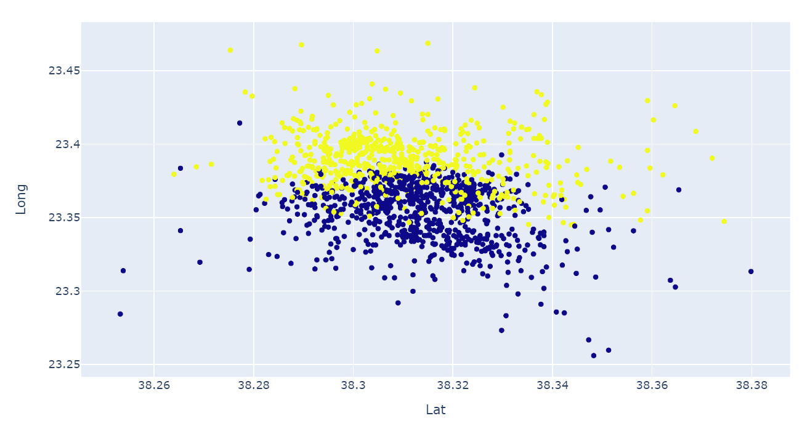

# Clustering-and-visualization-of-seismic-data-from-Thiva-area

## Python libraries used:
- Pandas
- Numpy
- Plotly
- Sklearn

## Project description
Clustering of a seismic catalogue data (coordinates and seismic depths) and spatial projection of clustered epicenters. The data are collected for Thiva area and clustering relates to the sequential activation of local faults.

## Sample outputs
### Clusters

